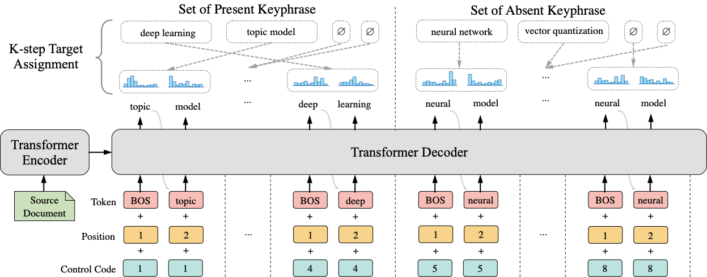

# One2Set

This repository contains the code for our ACL 2021 paper “[One2Set: Generating Diverse Keyphrases as a Set](https://arxiv.org/abs/2105.11134)”.




Our implementation is built on the source code from [keyphrase-generation-rl](https://github.com/kenchan0226/keyphrase-generation-rl) and [fastNLP](https://github.com/fastnlp/fastNLP). Thanks for their work.

If you use this code, please cite our paper:

```
@inproceedings{ye2021one2set,
  title={One2Set: Generating Diverse Keyphrases as a Set},
  author={Ye, Jiacheng and Gui, Tao and Luo, Yichao and Xu, Yige and Zhang, Qi},
  booktitle={Proceedings of ACL},
  year={2021}
}
```

## Dependency

- python 3.5+
- pytorch 1.0+

## Dataset

The datasets can be downloaded from [here](https://drive.google.com/file/d/16d8nxDnNbRPAw2pVy42DjSTVnT0WzJKj/view?usp=sharing), which are the tokenized version of the datasets provided by [Ken Chen](https://github.com/kenchan0226/keyphrase-generation-rl):

- The `testsets` directory contains the five datasets for testing (i.e., inspec, krapivin, nus, and semeval and kp20k), where each of the datasets contains `test_src.txt`  and `test_trg.txt`.
- The `kp20k_separated` directory contains the training and validation files (i.e., `train_src.txt`, `train_trg.txt`, `valid_src.txt` and  `valid_trg.txt`). 
- Each line of the `*_src.txt` file is the source document, which contains the tokenized words of `title <eos> abstract` .
- Each line of the `*_trg.txt` file contains the target keyphrases separated by an `;` character. The `<peos>` is used to mark the end of present ground-truth keyphrases and train a separate set loss for `SetTrans` model. For example, each line can be like `present keyphrase one;present keyphrase two;<peos>;absent keyprhase one;absent keyphrase two`. 

## Quick Start

The whole process includes the following steps:

- **`Preprocessing`**: The `preprocess.py` script numericalizes the `train_src.txt`, `train_trg.txt`,`valid_src.txt` and `valid_trg.txt` files, and produces `train.one2many.pt`, `valid.one2many.pt` and `vocab.pt`. 
- **`Training`**: The `train.py` script loads the `train.one2many.pt`, `valid.one2many.pt` and `vocab.pt` file and performs training. We evaluate the model every 8000 batches on the valid set, and the model will be saved if the valid loss is lower than the previous one.
- **`Decoding`**: The `predict.py` script loads the trained model and performs decoding on the five test datasets. The prediction file will be saved, which is like `predicted keyphrase one;predicted keyphrase two;…`. For `SetTrans`, we ignore the  $\varnothing$ predictions that represent the meaning of “no corresponding keyphrase”. 
- **`Evaluation`**: The `evaluate_prediction.py` script loads the ground-truth and predicted keyphrases, and calculates the $F_1@5$ and $F_1@M$ metrics.

For the sake of simplicity, we provide an one-click script in the `script` directory. You can run the following command to run the whole process with `SetTrans` model under `One2Set` paradigm:

```bash
bash scripts/run_one2set.sh
```

You can also run the baseline Transformer model under `One2Seq` paradigm with the following command:

```bash
bash scripts/run_one2seq.sh
```

**Note:** 

* Please download and unzip the datasets in the `./data` directory first. 
* To run all the bash files smoothly, you may need to specify the correct `home_dir` (i.e., the absolute path to `kg_one2set` dictionary) and the gpu id for `CUDA_VISIBLE_DEVICES`. We provide a small amount of data to quickly test whether your running environment is correct. You can test by running the following command:

```bash
bash scripts/run_small_one2set.sh
```

## Resources

You can download our trained model [here](https://drive.google.com/file/d/184DEgiIkQqJubIxiYiXepZnhhDuNoD5l/view?usp=sharing). We also provide raw predictions and corresponding evaluation results of three runs with different random seeds [here](https://drive.google.com/file/d/1KxdCcYfI9x2USS-sJ41xrgOPHPfFYvZF/view?usp=sharing), which contains the following files:
```
test
├── Full_One2set_Copy_Seed27_Dropout0.1_LR0.0001_BS12_MaxLen6_MaxNum20_LossScalePre0.2_LossScaleAb0.1_Step2_SetLoss
│   ├── inspec
│   │   ├── predictions.txt
│   │   └── results_log_5_M_5_M_5_M.txt
│   ├── kp20k
│   │   ├── predictions.txt
│   │   └── results_log_5_M_5_M_5_M.txt
│   ├── krapivin
│   │   ├── predictions.txt
│   │   └── results_log_5_M_5_M_5_M.txt
│   ├── nus
│   │   ├── predictions.txt
│   │   └── results_log_5_M_5_M_5_M.txt
│   └── semeval
│       ├── predictions.txt
│       └── results_log_5_M_5_M_5_M.txt
├── Full_One2set_Copy_Seed527_Dropout0.1_LR0.0001_BS12_MaxLen6_MaxNum20_LossScalePre0.2_LossScaleAb0.1_Step2_SetLoss
│   ├── ...
└── Full_One2set_Copy_Seed9527_Dropout0.1_LR0.0001_BS12_MaxLen6_MaxNum20_LossScalePre0.2_LossScaleAb0.1_Step2_SetLoss
    ├── ...
```


